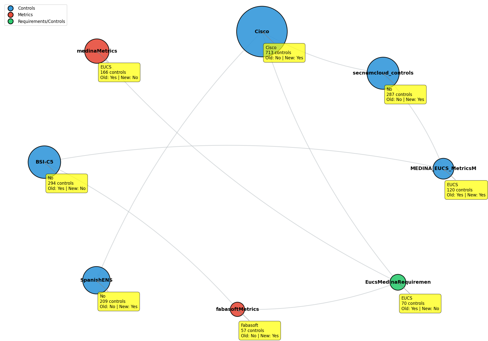

## Overview

This work uses the new metric and requirement definitions, together with their updated cross-scheme associations, to fine-tune the same model used in the previous version of the methodology.

To ensure comparability with earlier results, the **test set remains unchanged**.  
All controls, metrics, and associations that previously belonged to the test set are **excluded from the new training data** and kept in the test set for this updated procedure.

---

## New Associations

The new associations created by Iñaki, focused on **EUCS**, involve metrics that were already included in the previous test set.

- In the **new training set**, we use the same EUCS controls,  
  but linked to the **new schemes** instead of the old ones.
- The **old associations** remain exclusively in the **test set**.

### Old vs. New Associations

- **Old associations (kept in the test set):**
  - EUCS ↔ BSIC5

- **New associations (used for training, excluding BSIC5):**
  - EUCS ↔ SecNumCloud  
  - EUCS ↔ ISO 27002 *(content unavailable due to copyright)*  
  - EUCS ↔ ISO 27017 *(content unavailable due to copyright)*  
  - EUCS ↔ BSIC5 *(explicitly excluded from training)*

Because ISO 27002 and ISO 27017 are protected, **the only new associations we can currently include are EUCS ↔ SecNumCloud**.

---

## Important Note on Scheme Independence

The new associations link **EUCS controls** to controls in other schemes.  
However, this **does not imply any relationship between the controls of those other schemes**.

For example:

If an EUCS control is linked to both a SecNumCloud control and an ISO 27002 control,  
this **does not** mean that the SecNumCloud control is linked to the ISO 27002 control.

EUCS acts as the central reference point, but the other schemes remain independent from each other.

---

## Data Structure and Relationships

The following diagram illustrates the structure of the datasets and the relationships between the various metric, requirement, and association files used in the methodology:

